<!-- ─── Language Switch & ToC (top-right) ────────────────────────── -->
<div align="right">

<span style="color:#999;">🇺🇸 English</span> ·
<a href="README.zh-CN.md">🇨🇳 中文</a> &nbsp;&nbsp;&nbsp;&nbsp;&nbsp;&nbsp;|&nbsp;&nbsp;&nbsp;&nbsp;&nbsp; Table of Contents ↗️

</div>

<h1 align="center"><code>ddns-rs</code></h1>

<p align="center">
  🌐 <strong>Rust Dynamic-DNS in one binary</strong> — detects your public IP and keeps <em>multiple</em> DNS providers up-to-date, with a built-in dashboard and zero external dependencies.
</p>

<div align="center">

[](https://crates.io/crates/ddns)
[](https://github.com/lvillis/ddns-rs)
[](https://github.com/lvillis/ddns-rs/actions)
[](https://hub.docker.com/r/lvillis/ddns-rs)
[](https://hub.docker.com/r/lvillis/ddns-rs)
[](LICENSE)

</div>

---

## ✨ Features

| Feature                    | Description                                                          |
|----------------------------|----------------------------------------------------------------------|
| **Multi-provider upsert**  | Built-in Cloudflare & Aliyun drivers; add your own via feature flags |
| **Pluggable IP detectors** | HTTP · local interface · custom shell, with priority chain           |
| **Cron-based scheduler**   | Standard 6-field cron (second precision) + concurrency & back-off    |
| **Self-hosted dashboard**  | Tailwind + Alpine, dark/light auto; Cookie & Bearer auth supported   |
| **Zero runtime deps**      | Single static binary or multi-arch Docker image (< 10 MB)            |
| **Env-override ready**     | Any TOML key can be overridden via `DDNS__SECTION__KEY`              |


## 🖼 Architecture

```mermaid
graph TD
%% ── Client Layer ───────────────────────
    subgraph "Client"
        Browser["Web Browser<br/><sub>Dashboard UI</sub>"]
        ApiTool["REST Client / cURL"]
    end
    class Browser,ApiTool client;

%% ── Core Daemon ────────────────────────
    subgraph "ddns-rs Daemon"
        HTTP["HTTP Server<br/><sub>axum 0.8</sub>"]
        Scheduler["Scheduler<br/><sub>cron + back-off</sub>"]
        Detector["IP Detector<br/><sub>HTTP • NIC • Shell</sub>"]
        Status["Shared Status<br/><sub>Arc&lt;RwLock&gt;</sub>"]
    end
    class HTTP,Scheduler,Detector,Status daemon;

%% ── Provider Layer ─────────────────────
    subgraph "DNS Providers"
        Cloudflare
        Aliyun
        Custom["Your Driver"]
    end
    class Cloudflare,Aliyun,Custom provider;

%% ── Interactions ───────────────────────
    Browser  -- "SSE / REST" --> HTTP
    ApiTool  -- REST         --> HTTP

    HTTP     --> Status
    Scheduler --> Detector
    Detector  --> Scheduler
    Scheduler --> Status

    Scheduler --> Cloudflare
    Scheduler --> Aliyun
    Scheduler --> Custom

%% ── Styling ───────────────────────────
    classDef client    fill:#e3f2fd,stroke:#1976d2,stroke-width:1px;
    classDef daemon    fill:#e8f5e9,stroke:#388e3c,stroke-width:1px;
    classDef provider  fill:#fff8e1,stroke:#f57f17,stroke-width:1px;
```



## 🐳 Docker

```shell
docker run --rm \
  -v $PWD/ddns.toml:/opt/app/ddns.toml \
  -p 8080:8080 \
  -e DDNS__HTTP__JWT_SECRET=$JWT_SECRET \
  lvillis/ddns-rs
```