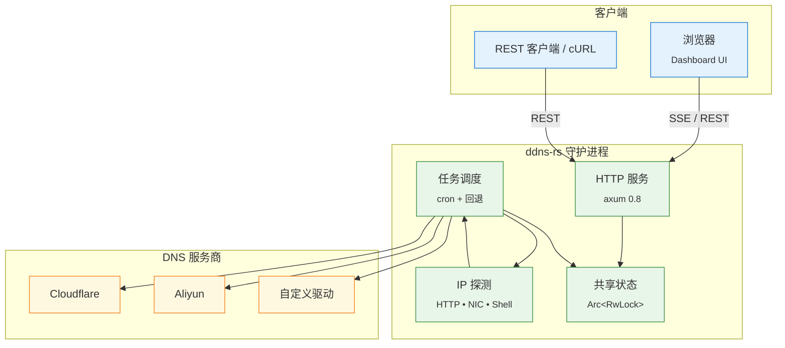

<!-- ─── 语言切换 & 目录（右上角） ─────────────────────────────── -->
<div align="right">

<a href="README.md">🇺🇸 English</a> ·
<a aria-disabled="true" style="color:#999;text-decoration:none;">🇨🇳 中文</a>

<br/>
目录 ↗️
</div>

<h1 align="center"><code>ddns-rs</code></h1>

<p align="center">
  🌐 <strong>Rust 动态 DNS 一体化工具</strong> — 自动侦测公网 IP，并同时更新 <em>多家</em> DNS 解析记录；内置仪表盘，零额外运行依赖。
</p>

<div align="center">

[](https://crates.io/crates/ddns)
[](https://github.com/lvillis/ddns-rs)
[](https://github.com/lvillis/ddns-rs/actions)
[](https://hub.docker.com/r/lvillis/ddns-rs)
[](https://hub.docker.com/r/lvillis/ddns-rs)
[](LICENSE)

</div>

---

## ✨ 功能亮点

| 功能                          | 说明                                                                 |
|-------------------------------|----------------------------------------------------------------------|
| **多云厂商变更 (upsert)**     | 内置 Cloudflare & Aliyun 驱动；亦可通过 feature flag 添加自定义驱动 |
| **可插拔 IP 探测器**          | HTTP · 本机网卡 · 自定义 Shell，支持优先级链                         |
| **基于 Cron 的调度器**        | 6 字段标准 Cron（秒级）+ 并发控制 + 退避重试                         |
| **自托管仪表盘**              | Tailwind + Alpine，自动深浅主题；支持 Cookie 和 Bearer 认证          |
| **零运行依赖**                | 静态单文件可执行或多架构 Docker 镜像（< 10 MB）                      |
| **环境变量覆盖**              | 任何 TOML 键都可用 `DDNS__SECTION__KEY` 覆盖                        |

## 🖼 架构示意



## 🐳 Docker

```shell
docker run --rm \
  -v $PWD/ddns.toml:/opt/app/ddns.toml \
  -p 8080:8080 \
  -e DDNS__HTTP__JWT_SECRET=$JWT_SECRET \
  lvillis/ddns-rs
```